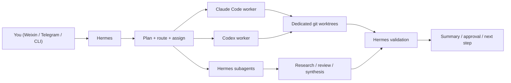

# Hermes as a Software Control Tower

This guide shows how to use Hermes as a **top-level orchestrator** for software development:

- **Hermes** handles planning, routing, verification, reporting, and cross-project coordination
- **Claude Code** acts as the primary coding worker for complex implementation and refactors
- **Codex** acts as a supporting worker for bounded tasks, review, and batch fixes
- **git worktrees** provide hard isolation for parallel work

This is the most reliable pattern when you want one long-lived Hermes instance to coordinate **multiple software projects** without mixing contexts.

---

## Table of Contents

1. [What Hermes Should and Should Not Do](#what-hermes-should-and-should-not-do)
2. [Recommended Architecture](#recommended-architecture)
3. [The Core Rule: One Project, One Active Session](#the-core-rule-one-project-one-active-session)
4. [Project Control File: `PROJECT.md`](#project-control-file-projectmd)
5. [Project Directory Contract](#project-directory-contract)
6. [AI-Facing Documentation Contract](#ai-facing-documentation-contract)
7. [The Execution Model](#the-execution-model)
8. [Worktree Strategy](#worktree-strategy)
9. [Project Rules: `AGENTS.md`](#project-rules-agentsmd)
10. [When to Use `CLAUDE.md`](#when-to-use-claudemd)
11. [Multi-Project Operation Model](#multi-project-operation-model)
12. [Isolation Levels and Cleanup](#isolation-levels-and-cleanup)
13. [Messaging Setup for Multi-Project Control](#messaging-setup-for-multi-project-control)
14. [Daily Workflow](#daily-workflow)
15. [Worker Invocation Patterns](#worker-invocation-patterns)
16. [Audit and Review Loop](#audit-and-review-loop)
17. [Validation Model](#validation-model)
18. [Recommended Skills](#recommended-skills)
19. [Common Failure Modes](#common-failure-modes)
20. [Recommended Starting Setup](#recommended-starting-setup)

---

## What Hermes Should and Should Not Do

Treat Hermes as your **control tower**, not your only coding worker.

### Hermes should own

- project intake
- reading `AGENTS.md`
- writing implementation plans
- splitting work into parallel streams
- choosing the right worker for each task
- verifying results
- summarizing status and risks
- sending updates through Telegram, Weixin, Email, or CLI

### Hermes should not own

- every large code edit itself
- long-running parallel implementation in the same checkout
- low-level branch hygiene across many concurrent tasks
- real-time multi-file coding in one shared worktree

The reason is simple: Hermes is strongest when it preserves **state, coordination, and judgment**. Claude Code and Codex are strongest when they get a **clear task in an isolated workspace**.

---

## Recommended Architecture



### Role split

| Layer | Main job |
|-------|----------|
| Hermes | control, planning, routing, verification, reporting |
| Claude Code | complex implementation, deep refactors, exploratory debugging |
| Codex | bounded tasks, review, batch fixes, mechanical edits |
| git worktree | execution isolation |
| `AGENTS.md` | per-project rules |
| profiles | full environment isolation only when truly needed |

---

## The Core Rule: One Project, One Active Session

Do **not** mix multiple projects in a single active Hermes session.

Use this rule:

- one active session per project
- one worktree per parallel coding task
- one worker per worktree

Why:

- conversation history stays relevant
- plan summaries remain trustworthy
- context compression does not mix unrelated repositories
- model routing decisions stay stable
- token spend stays lower

If you switch projects, start a fresh session or explicitly resume the right one.

See also: [Sessions](/docs/user-guide/sessions) and [Git Worktrees](/docs/user-guide/git-worktrees).

---

## Project Control File: `PROJECT.md`

Every long-lived project should have a `PROJECT.md` at its root.

This file is the project's **live control surface**. It is where Hermes should look for:

- project identity
- local path
- repo URL and default branch
- active and blocked tasks
- current worktrees
- current workers
- deployment state
- current risks
- special instructions for Hermes

Think of the split like this:

- `PROJECT.md` = what is true **right now**
- `AGENTS.md` = what the project expects **in general**
- `CLAUDE.md` = what Claude Code should additionally know

If a project is going to be developed over many rounds, `PROJECT.md` is what helps Hermes avoid losing the operational picture between sessions.

---

## Project Directory Contract

Each project should have its own main directory:

```text
/Users/chatsign/Projects/
  project-a/
  project-b/
  project-c/
```

Inside each project, keep a predictable structure so Hermes and downstream coding agents do not need to guess:

```text
project-a/
  PROJECT.md
  AGENTS.md
  CLAUDE.md
  README.md
  docs/
    plans/
    architecture/
  src/
  tests/
  scripts/
  tmp/
  .artifacts/
```

### Directory responsibilities

| Path | Purpose |
|------|---------|
| `PROJECT.md` | live project control file: identity, work queue, deployment, worktrees, risks |
| `AGENTS.md` | shared contract for Hermes and all coding workers |
| `CLAUDE.md` | Claude Code-specific guidance only |
| `docs/plans/` | implementation plans and execution plans |
| `docs/architecture/` | design decisions, system diagrams, major subsystem notes |
| `src/` | production code |
| `tests/` | automated tests |
| `scripts/` | repo-owned scripts that are intentionally versioned |
| `tmp/` | project-local temporary files that may exist during development but should not be committed |
| `.artifacts/` | generated review artifacts, reports, screenshots, traces, or structured outputs that are useful but not production code |

### Strong recommendations

- Keep temporary files out of the project root.
- Do not leave generated scratch files next to production code unless the repository explicitly expects that pattern.
- If a worker must create disposable output, prefer:
  - project-local `tmp/`
  - system temp directories
  - a designated artifact directory like `.artifacts/`
- Add `tmp/` and `.artifacts/` to `.gitignore` unless you explicitly want them versioned.

This matters because outer-loop Hermes should be able to audit whether workers are leaving clutter or hiding state in random places.

---

## AI-Facing Documentation Contract

Every project should expose stable instructions for development agents.

If you want a copy-pasteable starting point, use the internal template at `docs/templates/project-ai-contract.md` in the repository root.

### `PROJECT.md` is the operational contract

`PROJECT.md` should tell Hermes:

- where the project lives
- which repository it belongs to
- what the current work queue looks like
- which worktrees are active
- which worker is doing what
- what deployment state matters right now
- what risks or blockers are currently open

This file should change as the project changes.

### `AGENTS.md` is the primary stable contract

`AGENTS.md` should tell any development AI:

- what the project is
- what is currently in scope
- how to install and run it
- how to test it
- where production code lives
- where temporary files belong
- what must not be changed
- what counts as done
- how work should be routed across Hermes, Claude Code, and Codex

### `CLAUDE.md` is a narrow extension

Use `CLAUDE.md` only for Claude Code-specific guidance such as:

- preferred Claude workflow
- safe commands for Claude to run
- files Claude should treat carefully
- expected multi-turn execution style

If `CLAUDE.md` duplicates or contradicts `AGENTS.md`, Hermes should flag that during review.

### Recommended `AGENTS.md` sections

Use a structure like this:

```md
# Project Rules

## Goal
What this project does and what matters right now.

## Structure
- App code: `src/`
- Tests: `tests/`
- Scripts: `scripts/`
- Temporary outputs: `tmp/`
- Review artifacts: `.artifacts/`

## Commands
- Install: `uv sync`
- Run: `uv run python app.py`
- Test: `pytest -q`
- Lint: `ruff check .`

## Safety Rules
- Do not edit `infra/production/` without explicit approval
- Do not commit `.env`
- Put disposable files in `tmp/` or the system temp directory
- Do not create new utility modules if an equivalent helper already exists

## Worker Routing
- Hermes: planning, coordination, final review
- Claude Code: complex refactors, exploratory implementation
- Codex: bounded changes, cleanup, review

## Done Criteria
- Relevant tests pass
- No duplicate helper introduced
- No stray temp files left in the repo root
- Documentation updated if behavior changed
```

### Recommended `CLAUDE.md` sections

Keep it smaller:

```md
# Claude Code Notes

## Safe Workflow
- Read `AGENTS.md` first
- Prefer small commits
- Do not broaden scope without reporting it

## Path Rules
- Put scratch files in `tmp/`
- Put generated reports in `.artifacts/`

## Review Reminder
- Before finishing, check for duplicated helpers and accidental root-level files
```

---

## The Execution Model

### 1. Hermes receives a project task

Example:

```text
Project root: /Users/chatsign/Projects/project-a
Read PROJECT.md first.
Then read AGENTS.md.
Do not implement yet.
Write a plan, then split the work into:
1. tasks you should keep
2. tasks for Claude Code
3. tasks for Codex
Use separate git worktrees for any parallel implementation.
```

### 2. Hermes writes the plan

Hermes should produce:

- goal
- scope
- constraints
- affected files or subsystems
- test strategy
- worker assignment
- merge and validation order

### 3. Hermes routes tasks

Use this routing logic:

#### Send to Claude Code

- multi-file refactors
- architecture changes
- changes that need iterative reasoning
- debugging with uncertain root cause
- work likely to require multiple implementation passes

#### Send to Codex

- clearly bounded edits
- review tasks
- batch cleanup
- repetitive fixes across many files
- tasks with explicit acceptance criteria and little ambiguity

#### Keep in Hermes

- planning
- comparing approaches
- coordinating multiple workers
- reading reports back
- final validation
- cross-project status tracking

---

## Worktree Strategy

For parallel coding, **never** let multiple workers share the same checkout.

Create a stable worktree root outside or beside your main projects:

```text
/Users/chatsign/Projects/
  project-a/
  project-b/

/Users/chatsign/Worktrees/
  project-a/
    feat-login/
    refactor-auth/
    fix-timeouts/
  project-b/
    admin-panel/
    docs-cleanup/
```

### Example

```bash
cd /Users/chatsign/Projects/project-a
git worktree add -b feat/login /Users/chatsign/Worktrees/project-a/feat-login main
```

Then run a worker inside that worktree, not in the main checkout.

This gives you:

- isolated files
- isolated branch history
- cleaner review and merge flow
- less risk of two agents touching the same file

See: [Git Worktrees](/docs/user-guide/git-worktrees).

---

## Project Rules: `AGENTS.md`

Every project should have an `AGENTS.md` at its root.

Hermes should read this file before planning or delegating work.

### Minimum contents

Your project-level `AGENTS.md` should define:

- what the project is
- how to install dependencies
- how to run tests
- how to lint and format
- what files or folders are high-risk
- what changes require special care
- how work should be split between Hermes, Claude Code, and Codex
- what counts as done

### Suggested structure

```md
# Project Rules

## Goal
Short description of the project and current priorities.

## Commands
- Install: `uv sync`
- Run: `uv run python app.py`
- Test: `pytest -q`
- Lint: `ruff check .`

## Risk Boundaries
- Do not edit `infra/production/` unless explicitly requested
- Do not commit `.env`
- Do not rewrite old migrations

## Worker Routing
- Complex refactors -> Claude Code
- Bounded changes and review -> Codex
- Parallel tasks must use separate git worktrees

## Validation
- Run relevant tests before handoff
- Summarize changes
- Report residual risks
```

This one file becomes the common contract between you, Hermes, Claude Code, and Codex.

See: [Context Files](/docs/user-guide/features/context-files).

---

## When to Use `CLAUDE.md`

Use `CLAUDE.md` only if you want Claude Code to have extra instructions beyond the shared project rules.

Keep it narrow. Good examples:

- preferred Claude Code workflow
- repository-specific review habits
- test ordering preferences
- special refactor cautions for Claude Code

Do **not** let `CLAUDE.md` conflict with `AGENTS.md`.

Use:

- `AGENTS.md` for shared project policy
- `CLAUDE.md` for Claude-specific execution hints

---

## Multi-Project Operation Model

If you are handling multiple projects at once, use three layers of isolation.

### Layer 1: Hermes session isolation

- one project per active session
- do not discuss project A and project B in the same active session
- create a fresh session when changing project focus

### Layer 2: worktree isolation

- one coding task per worktree
- one worker per worktree
- avoid parallel workers editing the same file

### Layer 3: profile isolation

Use separate Hermes profiles only when you need **full environment separation**, such as:

- different clients
- different API credentials
- different messaging gateways
- different long-term memory and skills
- different compliance or data-separation requirements
- a project that must be removable as a complete unit later
- a project whose long-term memory must never bleed into another project

If the same operator is coordinating multiple internal projects on one machine, **one profile is usually enough**.

See: [Profiles](/docs/user-guide/profiles).

---

## Isolation Levels and Cleanup

Not every project needs the same isolation level.

### Light isolation

Use:

- one repository directory
- one active Hermes session
- one `PROJECT.md`
- one `AGENTS.md`
- worktrees for parallel coding

This is enough for many internal projects.

### Strong isolation

Use:

- one repository directory
- one worktree root for that project
- one `PROJECT.md`
- one `AGENTS.md`
- one dedicated Hermes profile

Choose this when you need:

- stronger long-term memory separation
- distinct credentials or messaging routes
- cleaner client or compliance boundaries
- the ability to remove the entire project later with minimal leftovers

### Clean removal model

If a project is using strong isolation, the cleanest removal unit is:

```text
/Users/chatsign/Projects/project-a
/Users/chatsign/Worktrees/project-a/*
~/.hermes/profiles/project-a/
```

That is the architecture-consistent way to make a project both long-lived and cleanly disposable.

---

## Messaging Setup for Multi-Project Control

Messaging matters because Hermes is long-lived.

### Recommended pattern

- **Weixin**: owner control channel, approvals, quick check-ins
- **Telegram topics**: project-by-project working threads
- **CLI**: local execution, debugging, heavy tasks

Why this works:

- Weixin is excellent for control and approvals
- Telegram topics are better for keeping multiple project sessions alive in parallel
- CLI remains the most reliable place for deep local operations

If you only use Weixin, you can still switch between projects, but it behaves more like **one active desk at a time**, not multiple parallel tabs.

---

## Daily Workflow

Use this loop for each project:

1. Start or resume the correct Hermes session for the project
2. Ask Hermes to read `PROJECT.md` and `AGENTS.md`
3. Ask Hermes to write a plan before implementation
4. Let Hermes split the work into Hermes / Claude Code / Codex tasks
5. Create worktrees for parallel coding tasks
6. Run each worker in its assigned worktree
7. Have Hermes perform final validation
8. Have Hermes summarize results, risks, and next steps

### Example operator prompt

```text
Project root is /Users/chatsign/Projects/project-a.
Read PROJECT.md first.
Then read AGENTS.md.
Do not code yet.
Write a concrete implementation plan.
Split the work into:
1. control-tower tasks for yourself
2. complex tasks for Claude Code
3. bounded tasks for Codex
If parallel work is needed, create a separate git worktree for each coding task.
After worker execution, you should do final validation and summarize risks.
```

---

## Worker Invocation Patterns

### Claude Code pattern

Use Claude Code as the primary worker for deep implementation:

```bash
cd /Users/chatsign/Worktrees/project-a/feat-login
claude -p "Read AGENTS.md and implement phase 1 of the login feature. Run the relevant tests before finishing." --max-turns 12
```

Good fit:

- deep refactor
- architecture migration
- exploratory debugging
- multi-step implementation

### Codex pattern

Use Codex for bounded tasks and review:

```bash
codex exec --full-auto "Read AGENTS.md and fix the clearly actionable lint and typing issues in this worktree. Do not broaden scope." -C /Users/chatsign/Worktrees/project-a/fix-lint
```

Good fit:

- batch cleanup
- targeted fixes
- review and verification tasks
- low-ambiguity edits

---

## Audit and Review Loop

In the control-tower pattern, Hermes should review **every worker run**, not just the final result.

That review should be explicit.

### After each worker task, Hermes should audit

1. **Scope discipline**
   - Did the worker stay inside the assigned task?
   - Did it edit files outside the intended area?

2. **Wheel reinvention**
   - Did it add a new helper, wrapper, or utility that already exists?
   - Did it create a second implementation of an existing pattern?
   - Did it introduce new abstractions without a clear need?

3. **Temporary file hygiene**
   - Did it create scratch files in the repo root?
   - Did it leave generated files outside `tmp/`, `.artifacts/`, or the system temp directory?
   - Did it forget to clean up temporary outputs?

4. **Project structure compliance**
   - Did it put code in the right directory?
   - Did it place scripts, docs, tests, and generated artifacts in the expected locations?

5. **Testing discipline**
   - Did it actually run the right tests?
   - Did it merely claim success without evidence?

6. **Documentation consistency**
   - If behavior changed, did it update the relevant docs?
   - If it changed workflow assumptions, should `AGENTS.md` or `CLAUDE.md` be updated?

### Audit questions Hermes should ask itself

- Is this a real improvement, or just another wheel?
- Is this file meant to live in the repository, or is it temporary output?
- Did the worker create a utility because it is truly reused, or because it did not search first?
- Is the repository cleaner after the change, or messier?

### Practical outer-loop posture

Hermes should behave more like:

- commander
- reviewer
- auditor
- merge gate

And less like:

- another impulsive implementation worker

That means Hermes should prefer:

- giving explicit commands
- checking outputs
- comparing against project rules
- rejecting low-discipline changes

---

## Validation Model

Hermes should always remain the final verifier, even when Claude Code or Codex did the implementation.

Hermes should check:

- relevant tests passed
- scope stayed within plan
- diff matches the requested task
- no dangerous files were changed unexpectedly
- follow-up work is explicit

This prevents worker success messages from becoming the final truth.

---

## Recommended Skills

These built-in skills work especially well for the control-tower model:

- `hermes-agent`
- `writing-plans`
- `subagent-driven-development`
- `requesting-code-review`
- `claude-code`
- `codex`
- `github-pr-workflow`

This combination gives Hermes enough structure to:

- plan
- assign
- supervise
- review
- summarize

See: [Skills Catalog](/docs/reference/skills-catalog).

---

## Common Failure Modes

### Mixing projects in one session

Result:

- bloated context
- wrong assumptions
- confusing summaries

Fix:

- keep one active project per session

### Multiple workers in one checkout

Result:

- file collisions
- broken diffs
- hard-to-merge output

Fix:

- one worktree per worker task

### Using profiles too early

Result:

- too much operational overhead
- duplicated memory and config management

Fix:

- start with one profile unless you need hard isolation

### Letting workers define “done”

Result:

- weak validation
- incomplete fixes
- missed regressions

Fix:

- Hermes performs final validation and reporting

---

## Recommended Starting Setup

For most solo operators running Hermes as a persistent development control plane:

- one Hermes profile
- Weixin as owner control channel
- Telegram as optional multi-project thread workspace
- one `AGENTS.md` per repo
- Claude Code as primary implementation worker
- Codex as supporting worker
- git worktrees for every parallel coding task

This is the simplest setup that still scales well.

---

## A Practical Rule of Thumb

If a task needs:

- **judgment, coordination, or validation** -> Hermes
- **deep implementation or refactoring** -> Claude Code
- **tight scope, repetition, or review** -> Codex
- **parallel safety** -> git worktree
- **long-term project policy** -> `AGENTS.md`
- **hard separation of environments** -> profiles

That single routing rule is enough to make Hermes useful as a true development control tower instead of just another chat interface.
